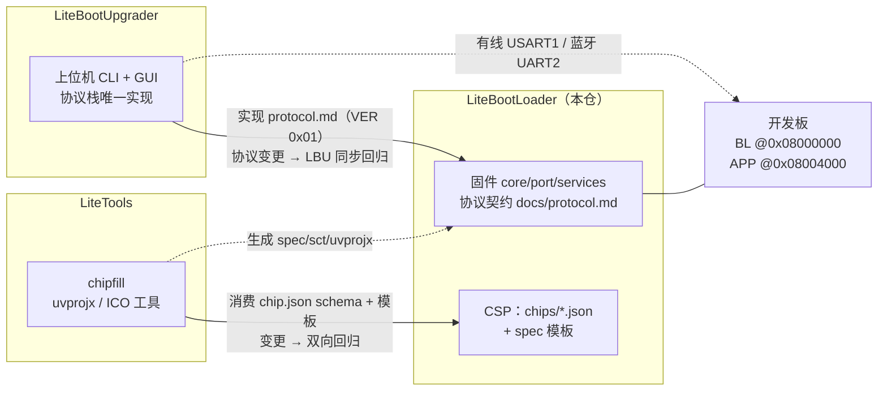

# 贡献指南（CONTRIBUTING）

感谢关注 LiteBootLoader！本页说明如何反馈问题与参与贡献，并承载仓库布局、现状与
三仓联动等开发向说明。固件的使用方式见 [docs/user_manual.md](docs/user_manual.md)。

## 反馈 Bug

提交 Issue 时请使用 **Bug 报告** 模板，尽量附上：

1. BL/APP 版本（上位机 `info` 命令返回值，或 `core/bl_version.h`）
2. 芯片与硬件环境（板型、调试器、串口工具）
3. 复现步骤（精确到命令与时序）
4. 串口日志或协议帧记录（十六进制，可用 VOFA+ / 上位机 `listen`/`raw` 抓取）
5. 期望行为与实际行为

升级链路问题请说明阶段：擦除 / 写入 / 校验 / 跳转 / APP 运行，以及是否涉及断电或复位。

## 请求芯片支持

使用 **芯片支持请求** 模板，说明：目标芯片型号、Flash/RAM 与页（扇区）结构、
Keil DFP 包版本、时钟方案、硬件是否在手。有板子的请求可优先获得验证支持。

也可以直接按下方「芯片支持包 PR」清单自行提交移植。

## 仓库布局

| 目录 | 职责 |
|---|---|
| `core/` | 状态机、协议、启动策略、元数据与通用逻辑（不依赖 HAL） |
| `services/` | 显示（默认 `display_led` LED 状态灯；`display_oled` OLED 可选）与调试（USART1 日志）服务——可选插件（ADR-019） |
| `chips/` | CSP 芯片清单（构建侧事实源）+ spec 模板 + 一致性测试 |
| `port/` | 芯片端口层（`stm32f1/f103c8t6` 全功能、`stm32f4/f411ceu6` 最小包已实现；`stm32g0/h7` 预留） |
| `bsp/` | 板级器件驱动（`oled_ssd1306` 等） |
| `app/examples/` | APP 示例工程（链接到 `0x08004000`） |
| `linker/` | 链接脚本 / 分散加载文件（`*.sct` 为生成产物） |
| `tools/` | VOFA+ 调试帧模板（uvprojx/ico 工程工具已迁至独立仓 [LiteTools](../LiteTools)） |
| `docs/` | 架构 / 协议 / 分区 / 接口 / 用户手册 / 移植指南（`docs/dev/` 为开发与代理文档） |
| `scripts/` | 工具链检查与构建脚本 |
| `third_party/` | CMSIS / HAL 依赖（原样捆绑，许可见 `third_party/CMSIS/LICENSES.md`） |

## 项目现状与路线

- **当前支持包：STM32F103C8T6**（Cortex-M3，64 KiB Flash / 20 KiB RAM）——目前唯一完成
  全链路硬件验证的支持包：14/14 验收项通过、上位机升级 E2E、断电恢复演练；
  产物尺寸与 SHA 见 [CHANGELOG.md](CHANGELOG.md)
- **服务可选挂载与最小示例配置（0.3.0，ADR-019）**：唯一强制服务 = 有线串口通道；
  显示/日志为链接期可选插件（`core/bl_service_stub.c` 弱默认兜底）。默认 BL 示例配置
  为最小集（LED 状态灯 + 串口日志，12 180 B ≤ 16K），OLED/蓝牙/I2C 作为可选能力保留
  （启用方式见 [docs/porting_guide.md](docs/porting_guide.md) §3.1）
- **蓝牙空口升级（0.2.0，可选能力）**：HC-05（SPP）经 UART2 接入为 transport 通道 1，
  WIFI 仅 API 预留；OTA 状态查询命令 0x10（ADR-016）；蓝牙真机在环已通过——默认配置
  未启用，启用方式见 porting_guide §3.1
- **STM32F411CEU6 最小支持包（ADR-017）**：仅串口升级 + 引导跳转（无 OLED/蓝牙/I2C），
  编译/一致性/上板 HIL 均已通过（升级-跳转-回环-复位注入实测，见 CHANGELOG）；
  F407ZGT6 规划为 f4 家族第二个复用点
- STM32G0 / H7 端口目录已预留（仅骨架）；新增芯片支持的完整流程见
  [docs/porting_guide.md](docs/porting_guide.md)
- 多芯片基础设施（CSP：芯片清单 + 模板化工程生成 + 擦除单元抽象 + IWDG 参数化）已落地，
  设计见 [docs/dev/design.md](docs/dev/design.md) ADR-015

## 三仓布局与联动

| 仓库 | 职责 | 耦合契约与联动规则 |
|---|---|---|
| **LiteBootLoader**（本仓） | 固件 + 协议契约 | `docs/protocol.md` 是协议唯一规范；协议/分区/跳转行为变更先改文档并升版本 |
| [LiteBootUpgrader](../LiteBootUpgrader) | 上位机 CLI + GUI（串口升级/跳转/自检） | 实现本仓 protocol.md 当前版本（VER 0x01）；本仓协议或行为变更后，LBU 需同步并通过 `test_host_protocol.py` 与硬件 E2E 回归 |
| [LiteTools](../LiteTools) | Keil uvprojx / ICO 工具 + chipfill | 消费本仓 `chips/<id>.json` schema 与 `chips/templates/` spec 模板；schema 或模板变更需 LiteTools 单测 + 本仓 `chips/test_chip.py` 双向回归 |

三仓耦合关系图示：



## 开发环境

- 运行 `scripts/check_toolchain.sh`（Git Bash/Linux）或 `scripts/check_toolchain.bat`（CMD）
  检查 CMake、arm-none-eabi-gcc、Make/Ninja、OpenOCD、Python、Keil（UV4）
- Python 依赖建议隔离运行：`uv run --with <pkg>` 或 venv；避免污染全局解释器
- 主工具链为 Keil MDK（编译器 AC5）；注意 Windows 下 git autocrlf，勿让
  `.sct`/`.uvprojx` 混入异常换行符

## 构建与验证

一键构建（chip.json + 模板 → spec/sct → 生成工程 → UV4 全量重建 → 退出码判定 → 生成 bin）：

```bash
# CHIP 指定芯片清单（默认 f103c8t6）；TARGETS 默认 "bootloader app"
CHIP=f103c8t6 bash scripts/build_keil.sh

# 改了 chips/<id>.json 或模板后：重新生成全部产物（test_chip.py 强制往返一致）
python chips/test_chip.py
```

手工等价流程与独立仓工具（LiteTools 位于 `../LiteTools`）：

```bash
python ../LiteTools/uvprojx/chipfill.py --chip chips/f103c8t6.json --target bootloader \
    --spec-out bootloader.spec.json --sct-out linker/bootloader.sct   # 芯片清单 -> spec 与 scatter
python ../LiteTools/uvprojx/generator.py bootloader.spec.json -o bootloader.uvprojx  # spec -> 工程
"<Keil 安装目录>/UV4/UV4.exe" -r bootloader.uvprojx -j0 -o keil_build.log
# 退出码：0=无警告无错误，1=有警告，≥2=有错误
"<Keil 安装目录>/ARM/ARMCC/bin/fromelf.exe" --bin --output=bootloader.bin Objects/bootloader.axf

# Keil 工程解析 / 生成（工具在独立仓 ../LiteTools）
python ../LiteTools/uvprojx/parser.py <工程.uvprojx> -o spec.json
python ../LiteTools/uvprojx/generator.py spec.json -o new.uvprojx        # 创建模式（结果需在 Keil 中人工验证）
python ../LiteTools/uvprojx/generator.py spec.json --update old.uvprojx  # 更新模式（保留未知字段，自动备份）

# ICO 图标解析 / 生成（同在 ../LiteTools）
python ../LiteTools/ico/parser.py <文件.ico>
python ../LiteTools/ico/generator.py --sizes 16,32,48,256 -o icon.ico icon.png
```

硬件在环验证（板子在线时；上位机与钻具在 `../LiteBootUpgrader`）：

```bash
# 15 步升级流程自检
uv run --python 3.12 --with pyserial ../LiteBootUpgrader/bl_upgrade.py selftest --port COMx

# 参数区写入中断恢复钻具（需调试器）
uv run --python 3.12 --with pyserial --with pyocd ../LiteBootUpgrader/bl_powerloss_drill.py --port COMx --rounds 10
```

## 贡献代码

### Bug 修复 PR

1. 复现优先：能写主机侧单测的先写单测；硬件在环用例参考 docs/dev/test_plan.md
2. 根因修复，最小改动；不借机重构
3. 附回归证据：构建退出码、测试输出；涉及时序/掉电安全的修复需硬件演练说明
4. 涉及协议、分区、接口或默认假设时，同步对应文档与 CHANGELOG

### 芯片支持包（CSP）PR

按以下清单执行（详细移植说明见 [docs/porting_guide.md](docs/porting_guide.md)）：

1. `chips/<id>.json`：按 `chips/f103c8t6.json` 的 schema 提供 device / build / memory /
   partitions / erase_units / clock / pins / iwdg / sysmem
2. `port/<family>/<chip>/`：实现 `port/bl_port.h` 全部 ops（flash / uart / i2c / gpio /
   wdg / clock / systick）；`board_config.h` 为 C 侧唯一常量出处，与 chip.json 一致
3. 一致性：`python chips/test_chip.py` 通过（清单↔board_config 一致 + spec/sct 模板往返）
4. 工程生成：LiteTools `chipfill.py` + `generator.py` 生成 spec/sct/uvprojx 无错
5. 构建回归：BL/APP 编译通过，bin 尺寸不超过 chip.json 分区表限额
6. 硬件回归（板在手时）：烧录 → 上位机升级 → 校验 → 跳转 → 断电恢复演练；
   无板时在 PR 中明确标注「未验证」
7. 文档同步：architecture / partition 增补、CHANGELOG 条目

### 质量基线

合并前以下基线不得回退（完整清单见 AGENTS.md §9.4 与 docs/dev/test_plan.md）：
BL/APP 编译通过且尺寸达标、升级-校验-跳转链路完好、参数区断电恢复、
APP CRC 错误拒绝跳转、IWDG 接管无误复位。

## 提交规范

- 提交信息遵循 **Conventional Commits 1.0.0**：`feat` / `fix` / `docs` / `style` /
  `refactor` / `perf` / `test` / `chore` / `port`（细则见 docs/dev/versioning.md）
- 版本遵循 **SemVer 2.0.0**：`fix` → PATCH，`feat` → MINOR，`BREAKING CHANGE` → MAJOR
- 一个 PR 聚焦一件事；大改动建议先开 Issue 讨论

## 开发文档索引

| 文档 | 内容 |
|---|---|
| [docs/dev/design.md](docs/dev/design.md) | 总体设计与固化决策记录（CRC 参数、升级模式、LED/日志策略等 ADR） |
| [docs/dev/versioning.md](docs/dev/versioning.md) | SemVer 与 Conventional Commits 细则 |
| [docs/dev/test_plan.md](docs/dev/test_plan.md) | 测试计划：四级测试、selftest 清单、验收对照表、实测教训索引 |
| [docs/dev/bluetooth_notes.md](docs/dev/bluetooth_notes.md) | 蓝牙 HC-05 核实笔记：引脚语义、AT 一次性配置、来源引用 |
| [docs/dev/vofa_plus.md](docs/dev/vofa_plus.md) | VOFA+ 定位与可行性说明 |
| [AGENTS.md](AGENTS.md) | 代理/编码助手的仓库工作规范 |
