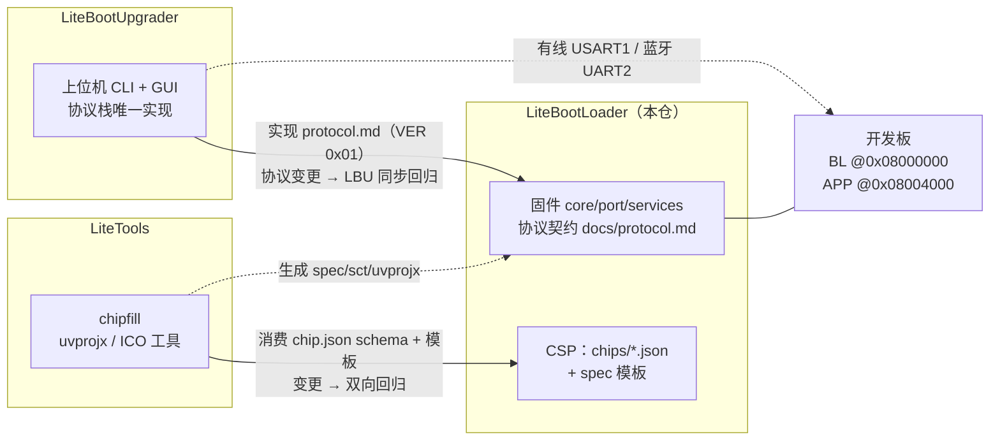

# LiteBootLoader — STM32 系列 BootLoader 框架

简体中文 | [English](README.en.md)

可编译、可测试、可移植的 STM32 BootLoader 框架（BL）：启动决策、APP 合法性校验、
USART1 有线 + 蓝牙（HC-05）双通道升级协议、OTA 状态查询、Flash 与参数区管理、
OLED/LED 状态显示、IWDG 看门狗与安全跳转。
通过 core/port 分层与**芯片支持包（CSP，`chips/*.json` + `port/<family>/<chip>/`）**
支持多芯片移植。

- **用户手册（怎么用看这里）**：[docs/user_manual.md](docs/user_manual.md)
- **问题反馈与贡献**：[CONTRIBUTING.md](CONTRIBUTING.md) · 版本历史：[CHANGELOG.md](CHANGELOG.md)

## 仓库现状

- **当前支持包：STM32F103C8T6**（Cortex-M3，64 KiB Flash / 20 KiB RAM）——目前唯一完成
  全链路硬件验证的支持包：14/14 验收项通过、上位机升级 E2E、断电恢复演练；
  产物尺寸与 SHA 见 [CHANGELOG.md](CHANGELOG.md)
- **蓝牙空口升级（0.2.0）**：HC-05（SPP）经 UART2 接入为 transport 通道 1，WIFI 仅 API
  预留；OTA 状态查询命令 0x10（ADR-016）；蓝牙真机在环验证进行中
- STM32F4 / G0 / H7 端口目录已预留（仅骨架）；新增芯片支持的完整流程见
  [docs/porting_guide.md](docs/porting_guide.md)
- 多芯片基础设施（CSP：芯片清单 + 模板化工程生成 + 擦除单元抽象 + IWDG 参数化）已落地，
  设计见 [docs/dev/design.md](docs/dev/design.md) ADR-015

## 仓库布局

| 目录 | 职责 |
|---|---|
| `core/` | 状态机、协议、启动策略、元数据与通用逻辑（不依赖 HAL） |
| `services/` | 显示（OLED+LED）与调试（USART1 日志）服务 |
| `chips/` | CSP 芯片清单（构建侧事实源）+ spec 模板 + 一致性测试 |
| `port/` | 芯片端口层（`stm32f1/f103c8t6` 已实现；`stm32f4/g0/h7` 预留） |
| `bsp/` | 板级器件驱动（`oled_ssd1306` 等） |
| `app/examples/` | APP 示例工程（链接到 `0x08004000`） |
| `linker/` | 链接脚本 / 分散加载文件（`*.sct` 为生成产物） |
| `tools/` | VOFA+ 调试帧模板（uvprojx/ico 工程工具已迁至独立仓 [LiteTools](../LiteTools)） |
| `docs/` | 架构 / 协议 / 分区 / 接口 / 用户手册 / 移植指南（`docs/dev/` 为开发与代理文档） |
| `scripts/` | 工具链检查与构建脚本 |
| `third_party/` | CMSIS / HAL 依赖（原样捆绑，许可见 `third_party/CMSIS/LICENSES.md`） |

## 快速开始

```bash
# 1) 工具链检查（Git Bash / Linux；CMD 用 scripts\check_toolchain.bat）
bash scripts/check_toolchain.sh

# 2) Keil 工程解析 / 生成（工具在独立仓 ../LiteTools）
python ../LiteTools/uvprojx/parser.py <工程.uvprojx> -o spec.json
python ../LiteTools/uvprojx/generator.py spec.json -o new.uvprojx        # 创建模式（结果需在 Keil 中人工验证）
python ../LiteTools/uvprojx/generator.py spec.json --update old.uvprojx  # 更新模式（保留未知字段，自动备份）

# 3) ICO 图标解析 / 生成（同在 ../LiteTools）
python ../LiteTools/ico/parser.py <文件.ico>
python ../LiteTools/ico/generator.py --sizes 16,32,48,256 -o icon.ico icon.png
```

> **依赖隔离建议**：Python 依赖建议用隔离环境运行（`uv run --with <pkg> <脚本>` 或
> venv + pip 安装 pyserial/Pillow），避免污染全局解释器。下文示例按 uv 书写，替换为
> `python` 直跑亦可（前提是依赖已装在当前环境）。

## 构建（CSP 流程）

```bash
# 一键构建（chip.json+模板 -> spec/sct -> 生成工程 -> UV4 全量重建 -> 退出码判定 -> 生成 bin）
# CHIP 指定芯片清单（默认 f103c8t6）；TARGETS 默认 "bootloader app"
CHIP=f103c8t6 bash scripts/build_keil.sh

# 手工等价流程：
python ../LiteTools/uvprojx/chipfill.py --chip chips/f103c8t6.json --target bootloader \
    --spec-out bootloader.spec.json --sct-out linker/bootloader.sct   # 芯片清单 -> spec 与 scatter
python ../LiteTools/uvprojx/generator.py bootloader.spec.json -o bootloader.uvprojx  # spec -> 工程
"<Keil 安装目录>/UV4/UV4.exe" -r bootloader.uvprojx -j0 -o keil_build.log
# 退出码：0=无警告无错误，1=有警告，≥2=有错误
"<Keil 安装目录>/ARM/ARMCC/bin/fromelf.exe" --bin --output=bootloader.bin Objects/bootloader.axf

# 改了 chips/<id>.json 或模板后：重新生成全部产物（test_chip.py 强制往返一致）
python chips/test_chip.py

# 经 BL 协议升级 APP 并跳转（上位机在独立仓 ../LiteBootUpgrader，用法见 docs/protocol.md）
uv run --with pyserial ../LiteBootUpgrader/bl_upgrade.py upgrade app/examples/f103c8t6_app/app.bin --port COMx
uv run --with pyserial ../LiteBootUpgrader/bl_upgrade.py jump --port COMx
```

> 编译器固定为 **AC5**（V5.06u7，ADR-013）；CMSIS 内核头为 V1.30（详见
> `third_party/CMSIS/LICENSES.md`）。`<Keil 安装目录>` 按本机安装位置替换（Windows
> 典型为 `C:\Keil_v5`，或用 `KEIL_UV4` 环境变量指向 UV4.exe）。

## 三仓布局与联动

| 仓库 | 职责 | 耦合契约与联动规则 |
|---|---|---|
| **LiteBootLoader**（本仓） | 固件 + 协议契约 | `docs/protocol.md` 是协议唯一规范；协议/分区/跳转行为变更先改文档并升版本 |
| [LiteBootUpgrader](../LiteBootUpgrader) | 上位机 CLI + GUI（串口升级/跳转/自检） | 实现本仓 protocol.md 当前版本（VER 0x01）；本仓协议或行为变更后，LBU 需同步并通过 `test_host_protocol.py` 与硬件 E2E 回归 |
| [LiteTools](../LiteTools) | Keil uvprojx / ICO 工具 + chipfill | 消费本仓 `chips/<id>.json` schema 与 `chips/templates/` spec 模板；schema 或模板变更需 LiteTools 单测 + 本仓 `chips/test_chip.py` 双向回归 |

三仓耦合关系图示：



## 文档

| 文档 | 内容 |
|---|---|
| [docs/user_manual.md](docs/user_manual.md) | **用户手册**：硬件连接、首次烧录、日常升级、指示说明、故障排查 |
| [docs/architecture.md](docs/architecture.md) | 分层架构、ops 接口、运行时模型、状态机、内存预算 |
| [docs/protocol.md](docs/protocol.md) | 通信协议规范（帧格式、命令、示例帧、工具用法）——协议契约唯一出处 |
| [docs/partition.md](docs/partition.md) | Flash 分区、参数区双副本状态机与断电恢复 |
| [docs/external_interface.md](docs/external_interface.md) | 外部接口清单（引脚、协议摘要、抽象接口、OTA 接入点） |
| [docs/porting_guide.md](docs/porting_guide.md) | 移植指南：ops 实现要求、时钟双路径、跳转原子性、移植陷阱 |
| [docs/dev/bluetooth_notes.md](docs/dev/bluetooth_notes.md) | 蓝牙 HC-05 核实笔记：引脚语义、AT 一次性配置、来源引用 |
| [docs/dev/design.md](docs/dev/design.md) | 总体设计与固化决策记录（CRC 参数、升级模式、LED/日志策略等 ADR） |
| [docs/dev/versioning.md](docs/dev/versioning.md) | SemVer 与 Conventional Commits 细则 |
| [docs/dev/vofa_plus.md](docs/dev/vofa_plus.md) | VOFA+ 定位与可行性说明 |
| [docs/dev/test_plan.md](docs/dev/test_plan.md) | 测试计划：四级测试、selftest 清单、验收对照表、实测教训索引 |

## 问题反馈与贡献

- Bug 反馈与芯片支持请求：GitHub Issues（提供 `bug_report` 与 `chip_support` 模板）
- 贡献流程、芯片支持包（CSP）PR 清单与验收基线：[CONTRIBUTING.md](CONTRIBUTING.md)
- 代理/编码助手的仓库工作规范：[AGENTS.md](AGENTS.md)

## 许可

本项目原创代码（`core/`、`port/`、`services/`、`bsp/`、`app/`、`linker/`、`tools/`、`scripts/`、`docs/`）以 [MIT](LICENSE) 许可证发布（© 2026 Qingc）。

`third_party/` 下捆绑的第三方文件为**原样拷贝**（未做任何修改），保留其原始许可与版权声明；来源、许可条款与逐字节核验记录见 [third_party/CMSIS/LICENSES.md](third_party/CMSIS/LICENSES.md)。
