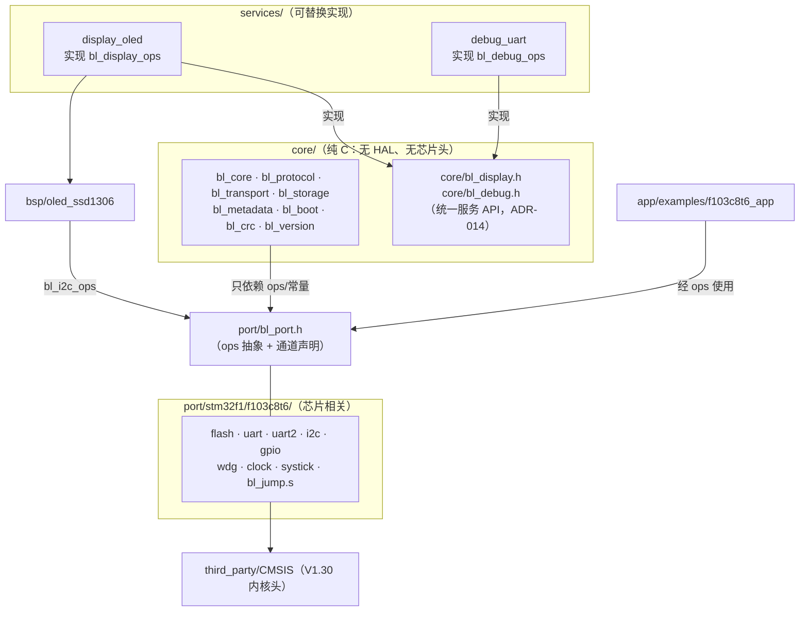
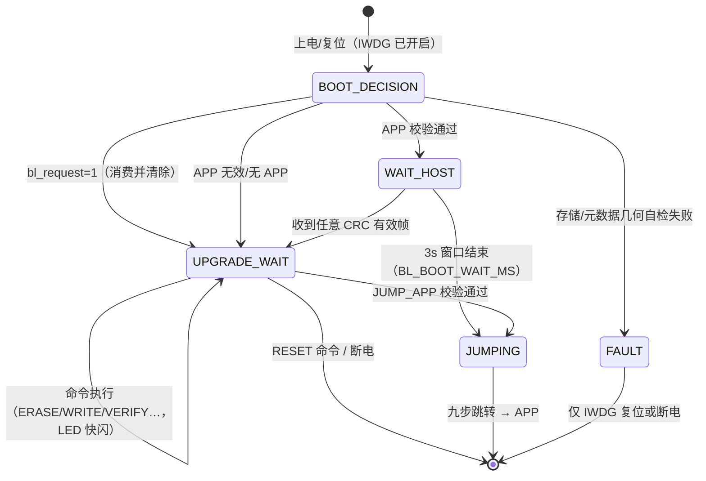
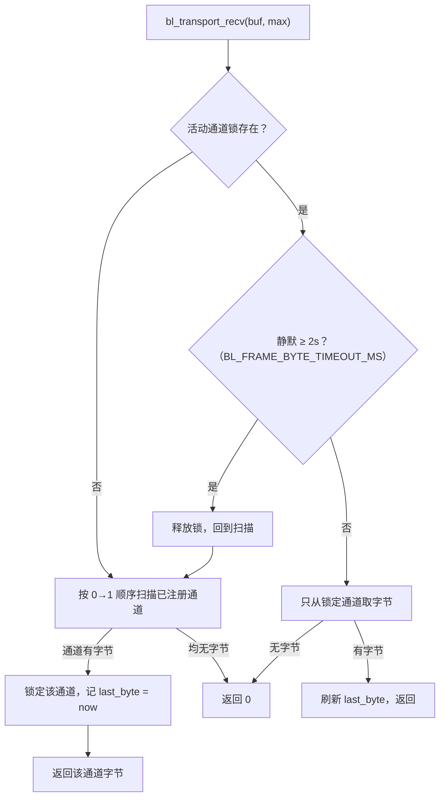

# LiteBootLoader 架构设计（architecture）

> 版本 0.3.0 · 2026-09-25 初版 · 2026-09-29 修订 · 状态：与实现同步
> 关联：[dev/design.md](dev/design.md)（固化决策） · [partition.md](partition.md)（Flash/元数据） · [protocol.md](protocol.md)（通信协议） · [external_interface.md](external_interface.md)（对外接口索引）

## 1. 分层总览

```text
┌────────────────────────────────────────────────────────────┐
│                       tools/（主机侧）                       │
│   uvprojx · ico · vofa+；上位机见独立仓 LiteBootUpgrader      │
└──────────────────────────────┬─────────────────────────────┘
                               │ USART1（帧协议，protocol.md）
┌──────────────────────────────▼─────────────────────────────┐
│  core/（纯 C，无 HAL、无芯片头文件，可主机侧单测）             │
│   bl_core    总状态机与命令分发                              │
│   bl_protocol 帧解析/组帧/CRC16/超时                         │
│   bl_storage Flash 抽象操作 + APP 擦写/CRC32                 │
│   bl_metadata 参数区双副本（状态机见 partition.md）           │
│   bl_boot    启动决策 / APP 校验 / 九步跳转                   │
│   bl_transport 通道注册表（USART1 有线/UART2 蓝牙/WIFI 占位，§6.1）│
│   bl_ui / bl_log 已服务化迁出（ADR-014）                      │
│   bl_crc / bl_version + core/bl_display.h · bl_debug.h 接口  │
├──────────────── services/（可替换服务实现，ADR-014）─────────┤
│   display_oled  OLED+LED 状态指示（实现 bl_display_ops）      │
│   debug_uart    USART1 日志（实现 bl_debug_ops）             │
├──────────────── ops 结构（§3）──────────────────────────────┤
│  port/stm32f1/f103c8t6/（芯片相关，可替换）                   │
│   flash.c uart.c uart2.c i2c.c gpio.c wdg.c clock.c systick.c │
├────────────────────────────────────────────────────────────┤
│  bsp/oled_ssd1306/（板级器件驱动，经 bl_i2c_ops 通信）        │
├────────────────────────────────────────────────────────────┤
│  CMSIS（third_party/）                                      │
└────────────────────────────────────────────────────────────┘
```

依赖规则（编译期可验证）：

1. `core/**` 不得 `#include` STM32/HAL/CMSIS 头文件，只能依赖 `port/bl_port.h` 暴露的 ops 接口。
2. `port/**` 不依赖 `core/**` 的业务逻辑，只实现 ops。
3. `bsp/**` 只依赖 `bl_i2c_ops`/`bl_gpio_ops` 抽象与自身配置，不直接访问寄存器。
4. 无 RTOS、无 `malloc/calloc/realloc`，全部静态分配（RAM 预算见 §9）。

依赖方向图示（与上列规则一一对应）：



## 2. 目录职责

| 目录 | 职责 | 说明 |
|---|---|---|
| `core/` | 状态机、协议、启动策略、元数据、CRC、UI 调度、日志 | 纯逻辑，可被主机侧单元测试编译（`BL_HOST_TEST` 分支 mock ops） |
| `port/stm32f1/f103c8t6/` | 首个端口实现（端口能力最全：串口 + 蓝牙 `uart2.c` + 软件 I2C） | 默认 BL 示例配置为最小集（ADR-019：`display_led` + `debug_uart`）；`port/stm32g0、stm32h7/` 预留空目录 |
| `port/stm32f4/f411ceu6/` | 第二个端口实现（ADR-017 最小包：串口+引导） | 无 I2C/uart2；显示走 `services/display_led` |
| `bsp/oled_ssd1306/` | SSD1306 初始化/绘字/分片刷新 | 经 `bl_i2c_ops`，非阻塞 |
| `app/examples/f103c8t6_app/`、`app/examples/f411ceu6_app/` | APP 示例 | 各自链接本芯片 APP 基址、设 VTOR、接管 IWDG、可请求进 BL |
| `linker/`、`linker/<id>/` | 散布加载文件（chipfill 生成产物） | f103c8t6 在 `linker/`（legacy 槽位），新芯片在 `linker/<id>/` |
| `tools/` | VOFA+ RawData 调试帧模板 | uvprojx/ico 工程工具已迁至独立仓 LiteTools；上位机 CLI/GUI 在 LiteBootUpgrader |
| `docs/`、`scripts/`、`third_party/` | 文档、构建脚本、CMSIS | F1/F4 CMSIS 平铺混放（文件名不冲突，ADR-015） |

## 3. 端口层 ops 接口

接口在 `port/bl_port.h` 定义（阶段 1 落地），F103 实现提供实例。方法签名先行固化：

```c
typedef struct {
    void    (*init)(void);
    bool    (*read)(uint8_t *buf, uint32_t len, uint32_t *out_len);   /* 非阻塞，从环形缓冲取 */
    bool    (*write)(const uint8_t *buf, uint32_t len);               /* 阻塞发送 */
} bl_uart_ops;

typedef struct {
    void    (*init)(void);
    bool    (*read)(uint32_t addr, uint8_t *buf, uint32_t len);       /* 任意对齐读 */
    bool    (*write)(uint32_t addr, const uint8_t *data, uint32_t len); /* 半字对齐，自动补 0xFF */
    /* 擦除单元（ADR-015，替代旧"页"抽象）：F1 均匀 1K 页；F4 非均匀扇区按表查询 */
    uint32_t (*unit_count)(void);                                     /* 全 Flash 擦除单元数 */
    uint32_t (*unit_addr)(uint32_t unit_index);                       /* 单元起始地址（越界返回 0） */
    uint32_t (*unit_size)(uint32_t unit_index);                       /* 单元大小（越界返回 0） */
    bool    (*erase_unit)(uint32_t unit_index);                       /* 擦除一个擦除单元 */
    bool    (*is_range_valid)(uint32_t addr, uint32_t len);           /* 分区边界检查 */
} bl_flash_ops;

typedef struct {
    void    (*init)(void);
    bool    (*write_mem)(uint8_t dev_addr, uint8_t reg, const uint8_t *data, uint16_t len);
    bool    (*read_mem)(uint8_t dev_addr, uint8_t reg, uint8_t *buf, uint16_t len);
} bl_i2c_ops;

typedef struct {
    void    (*init)(void);
    void    (*write)(uint8_t pin_id, bool level);
    void    (*toggle)(uint8_t pin_id);
    bool    (*read)(uint8_t pin_id);
} bl_gpio_ops;

typedef struct {
    void    (*init)(uint32_t timeout_ms);
    bool    (*set_timeout_ms)(uint32_t timeout_ms);   /* 运行时重配（ADR-015 升级期放宽） */
    void    (*refresh)(void);
} bl_wdg_ops;

typedef struct {
    void    (*init)(void);                 /* HSE→PLL 72MHz，失败回退 HSI（ADR-010） */
    uint32_t (*sysclk_hz)(void);
    uint32_t (*tick_ms)(void);             /* SysTick 毫秒计数 */
    void    (*delay_ms)(uint32_t ms);
} bl_clock_ops;
```

约定：所有 ops 返回 `bool` 表示成败；`bl_flash_ops.write/erase_unit` 由 `bl_storage` 层先做地址合法性检查（[partition.md](partition.md) §2 矩阵），ops 内部再做二次防御检查（物理边界由 board_config 定界）。core 不假设擦除单元等大（ADR-015）。

`bl_gpio_ops` 的 `pin_id` 为**板级逻辑引脚**（ADR-018）：逻辑 id → 物理引脚（端口序号/引脚号/极性）的映射数据唯一声明在 `board_config.h`，gpio.c 仅消费——换板改声明即可，chip.json `pins` 段与之强制一致（`chips/test_chip.py`）。

除 ops 结构外，`bl_port.h` 另提供跳转序列与系统级辅助函数（供 `bl_boot` 九步跳转使用，见 §5）：

```c
void bl_port_disable_irq(void);
void bl_port_stop_systick(void);
void bl_port_uart_deinit(void);
void bl_port_i2c_release(void);          /* PB8/PB9 恢复浮空模拟态 */
void bl_port_clear_pending_irqs(void);   /* NVIC ICPR 全清 */
void bl_port_set_vtor(uint32_t addr);
void bl_port_set_msp(uint32_t value);
void bl_port_jump(uint32_t reset_handler);
void bl_port_system_reset(void);
uint32_t bl_port_read_word(uint32_t addr);
```

## 4. 运行时模型

裸机超级循环 + SysTick 1 ms 节拍，无 RTOS：

```c
/* main 循环骨架（阶段 1 实现，此处为结构示意） */
while (1) {
    bl_wdg_ops.refresh();                 /* 喂狗点 1：主循环顶 */
    bl_display.tick(bl_clock_ops.tick_ms());  /* LED 模式 + OLED 限频分片刷新，非阻塞 */
    n = bl_uart_ops.read(rx_chunk, ...);  /* 非阻塞取 RX 环形缓冲 */
    bl_protocol_feed(rx_chunk, n);        /* 帧解析 → 完整帧交 bl_core 分发 */
    bl_core_poll();                       /* 状态机推进（等待窗口计时等） */
}
```

非阻塞原则：任何单次操作不得长时间霸占主循环——Flash 擦除按页拆分、CRC 校验按 1 KiB 块拆分、OLED 刷新按竖向条带分片，分片间回主循环（并喂狗，见 §7）。

## 5. BL 主状态机

| 状态 | 含义 | 出口 |
|---|---|---|
| `INIT` | 时钟/IWDG/串口/LED/OLED/参数区初始化 | → `BOOT_DECISION` |
| `BOOT_DECISION` | 读参数区副本，按 ADR-004 判定 | → 消费 bl_request / → `WAIT_HOST` / → `UPGRADE_WAIT` |
| `WAIT_HOST` | APP 有效，3 s 等待窗口（LED 慢闪，可输出启动横幅日志） | 超时 → `JUMPING`；收到 CRC 有效帧 → `UPGRADE_WAIT` |
| `UPGRADE_WAIT` | 停留等待主机命令（ADR-003，无超时） | 命令执行返回本状态；`JUMP_APP` 校验通过 → `JUMPING`；`RESET` → 复位 |
| `ERASING` / `WRITING` / `VERIFYING` | 命令执行的瞬时标记（供 LED 快闪与 OLED 进度），单命令内部完成 | 完成 → `UPGRADE_WAIT` |
| `JUMPING` | AGENTS.md §4.2 九步跳转执行 | → APP |
| `FAULT` | 致命错误（Flash 驱动失败等），LED 三短闪 | 仅 IWDG 复位或手动断电 |

说明：升级流程为**命令驱动**，无独立"会话状态机"；`ERASE_APP` 与 `WRITE_CHUNK` 无强制先后（写前确保擦除态——位图 + 扫描兜底，同页分块写入不互抹，ADR-007），`VERIFY_APP` 通过后自动持久化元数据。

状态机图示（`ERASING/WRITING/VERIFYING` 为命令执行期的瞬时标记，图中并入 UPGRADE_WAIT 自环）：



## 6. 中断与缓冲

| 中断 | 用途 | 说明 |
|---|---|---|
| SysTick | 1 ms 节拍、超时/窗口计时 | 仅递增毫秒计数，不做业务 |
| USART1_RX | 通道 0 收帧字节流 → 512 B 环形缓冲 | 帧最长 267 B（2+1+1+1+2+256+2+2）；@115200 约 11.5 B/ms，单页擦除（≤40 ms）期间的到达字节 ≤460 B，512 B 环形缓冲可吸收单页突发。更长的连续到达依赖主机"停等"协议（发出命令后等响应），溢出字节按帧同步丢弃处理（protocol.md §4.2） |
| USART2_RX | 通道 1（蓝牙 HC-05）收帧字节流 → 独立 512 B 环形缓冲 | 与 USART1 同构（uart2.c）；RAM 各占 512 B（§9） |
| USART1_TX / USART2_TX | 不用中断 | 响应/日志帧短，阻塞发送（≤272 B ≈ 24 ms @115200，可接受），文档化取舍 |

主循环内联执行耗时 Flash 操作时，RX 中断继续填充环形缓冲，不丢字节（缓冲深度按上表核算）。

### 6.1 通道注册表与仲裁（0.2.0 新增，ADR-016）

`core/bl_transport.c` 维护通道注册表：

| 序号 | 通道 | ops 单例 | 实现 | 状态 |
|---|---|---|---|---|
| 0 | USART1 有线 | `bl_uart` | `port/<chip>/uart.c` | 在用 |
| 1 | UART2 蓝牙（HC-05 SPP） | `bl_uart_bt` | `port/<chip>/uart2.c` | 0.2.0 起 |
| 2 | WIFI | `bl_wifi` | `port/wifi_stub.c` | 占位（规划书目标 2），实接入时补实现 |

- **注册条件**：实现 `bl_uart_ops` 三方法 + 两个接收统计函数并登记进 `s_chans[]`；统计
  缺席的占位通道（WIFI stub）在 init 时被跳过——预留真能编译、真能被选路识别。
  未接蓝牙的支持包以 `BL_TRANSPORT_BT_EN=0`（board_config.h，ADR-019：f103c8t6 与
  f411ceu6 默认均为 0）关闭通道 1 注册，槽位保留、通道号语义不变。
- **活动通道仲裁**：某通道收到首个字节即锁定（记录最后字节时刻），锁定期间只从该通道
  取字节；静默超过 `BL_FRAME_BYTE_TIMEOUT_MS`（与协议帧内字节超时同窗口）释放回轮询。
  半帧在途期间两路字节不会交错进同一全局解析器，protocol 层无感切换；响应经 `send`
  路由回请求所在通道，无活动通道时回落通道 0。残余的并发交错由 CRC 丢弃 + 主机重试兜底。
- 通道号经 `bl_transport_active_channel()` 供 OTA_QUERY（protocol.md §5.10）上报请求到达通道。
- `bl_transport.c` 不再直接 include 芯片端口头 `uart.h`（0.2.0 顺带修正的分层破绽）：
  各通道接收统计函数统一经 `bl_port.h` 声明，core 只依赖 `bl_port.h` + `board_config.h`。

接收仲裁图示（`send` 恒路由到活动通道、无活动通道回落通道 0）：



## 7. IWDG 喂狗点分布（固定清单）

1. 主循环顶部（保证 < 2 s 周期）；
2. `ERASE_APP` / 自动擦页：**每页之间**；
3. `VERIFY_APP`：**每 1 KiB 块之间**；
4. OLED 刷新：**每条带分片之间**；
5. `JUMPING` 执行九步前（喂狗后立即跳转，APP 接管窗口见验收 §9.4）。

禁止在以外的位置随意加喂狗掩盖长阻塞；新增耗时操作必须先在此清单登记喂狗点。

## 8. 显示/调试服务模型（ADR-014/ADR-019：可选插件）

服务是**可选插件**（ADR-019）：core 对 `bl_display`/`bl_debug` 的依赖由
`core/bl_service_stub.c` 的 `__weak` 空实现兜底——工程不链任何显示/调试服务时
core 照常链接（日志静默、无状态指示），链了真实服务则强符号覆盖、弱段被裁剪。
唯一强制挂载的是有线串口通道；main.c 只装配强制链路，服务硬件自举在各服务
init 内完成。

- `bl_display.tick(now_ms)` 每次主循环调用，内部按 `BL_UI_REFRESH_MS`（默认 200 ms）限频。
- 显示服务实现于 `services/display_led/`（LED 状态灯，默认示例配置所用）与
  `services/display_oled/`（OLED+LED，可选启用），语义状态由 core 注入
  （`set_state/set_progress/set_crc_ok`）。
- LED：由 BL 状态 + 协议活跃标志查 ADR-008 模式表驱动，无阻塞延时。
- OLED（可选启用 display_oled 时）：显示 BL 版本、芯片型号、APP 状态（有效/无效/大小/CRC）、升级进度（ERASE/WRITE/VERIFY 百分比）、CRC 状态、IWDG 状态（运行中时钟源）；刷新按竖向条带分片（如 8 列/片）经 `bl_i2c_ops` 发送，分片间返回。
- 用户自检页面：`bl_display_user_page()` **弱符号**（空实现，`bl_display.h` 声明），`BL_DISPLAY_USER_PAGE=1` 时在等待/升级模式替代标准页（display_oled 消费）。
- 调试服务实现于 `services/debug_uart/`（`bl_debug_ops`，USART1，协议活跃期静音）；core 侧仅用 `BL_LOGx` 宏，换通道只换实现。

## 9. 内存预算（AC5 实测回填，ARMCC V5.06u7 `-Ospace`；2026-09-29 按 ADR-018/019 复测）

| 项 | 预算/实测 | 说明 |
|---|---|---|
| RAM：RX 环形缓冲 | 2 × 512 B | §6：USART1 + USART2（蓝牙）各一（0.2.0 起） |
| RAM：OLED 帧缓冲 | 1 KiB | 128×64/8 |
| RAM：VERIFY 块缓冲 | 1 KiB | bl_storage 静态分配 |
| RAM：栈 | 1 KiB | 启动文件 Stack_Size |
| RAM：ZI 合计实测 | 4 404 B（含上列） | 20 KiB 上限的 21.5% |
| Flash：CRC32 常量表 | ≈ 1 KiB | ADR-001（在 RO-data 内） |
| Flash：实测 bin | **12 180 B ≈ 11.9 KiB（0.3.0 默认最小集）✓ ≤ 16 KiB** | 0.3.0 最小集 `ac658278…`；同版本含 OLED+蓝牙的全功能变体 15 464 B（`ebb2f93f…`）、无显示变体 12 616 B；0.2.0 全功能基线 15 324 B `499de4bc…`；0.1.0 基线 13 728 B `ce41b1b6…`；AC6 -Oz 时为 8 824 B，供参考 |
| APP .bin | **8 276 B，≤ 46 KiB（验收线）✓** | 0.3.0 重建（SHA `d1286297…`；0.2.0 为 8 152 B `534eb656…`） |

## 10. 签名验签链（0.4.0 新增，ADR-020，可选能力）

`BL_SIGN_EN=1` 的支持包（现仅 F411 可选；F103 BL 16K 预算不启用）在 storage 校验链中
加入认证环节，命令为 `0x11 VERIFY_SIGNED`（protocol.md §5.11）：

```text
check_app(size, crc, sha_out)   纯校验不落盘：范围检查 + CRC32 + SHA-256 同一读透（块间喂狗）
bl_sign_verify_digest(sha, sig) uECC P-256 验签（公钥 = 部署侧本地头，不入库）
persist_app(size, crc, auth=1)  幂等持久化（matches_app_signed 跳过判定）+ auth 字节置 1
```

- **失败不落盘**：CRC 错 → CRC_ERROR、验签错 → SIGN_ERROR，均不持久化；legacy VERIFY
  （0x05）持久化 auth=0，启用验签的固件拒绝跳转 auth=0 的镜像（`bl_boot_app_valid` 门禁，
  启动期零密码运算）。
- **关闭态零开销**：`BL_SIGN_EN=0` 时 SHA/验签代码经编译期裁剪 + armlink 未引用段剥离，
  两芯片 0.4.0 主线相对 0.3.1 仅 +252 B（auth 字段贯通与 verify 拆分管线，签名本体 0 B）。
- 开启态实测：F411 BL 18 784 B ≤ 32 KiB（验签本体 +5 788 B）；编译必弹启用警告
  （#177-D 携带提示文本，AC5 无 `#pragma message`/`#warning`，实测绕行方案见 bl_sign.c）。
- 密钥管理：公钥为部署侧本地头 `bl_sign_pubkey_local.h`（gitignore），测试密钥对由
  `tools/sign_image.py --keygen` 本地生成；固件仓不含任何密钥（含测试公钥）。
