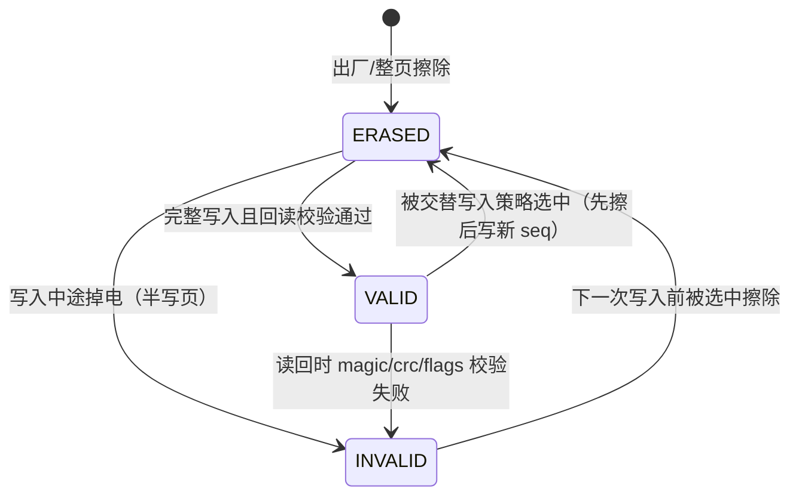
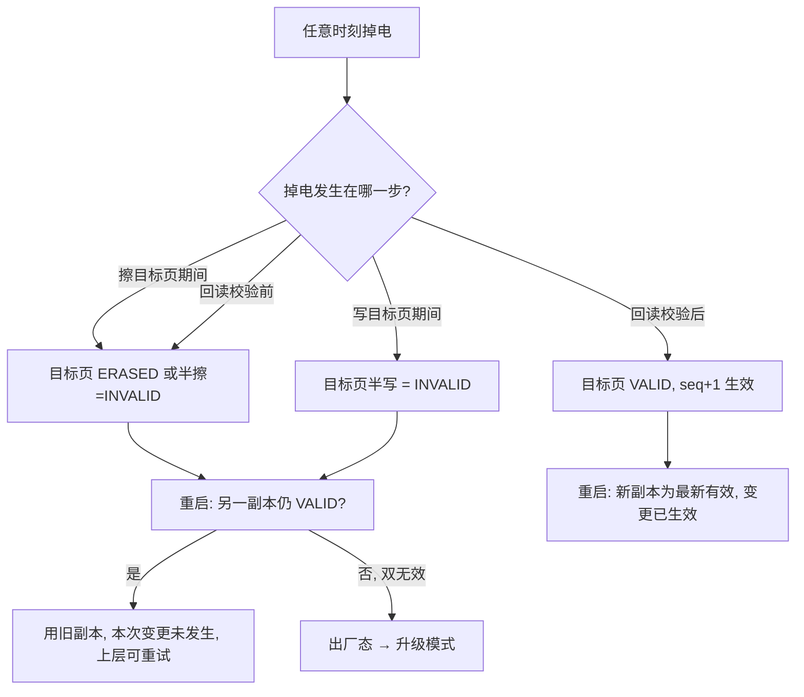

# Flash 分区与元数据设计（partition）

> 版本 0.1.0 · 2026-09-25 初版 · 2026-09-26 修订 · 状态：与实现同步（阶段 4 收尾）
> 关联：[dev/design.md](dev/design.md)（ADR-001/005/007） · [architecture.md](architecture.md)（bl_metadata/bl_storage 职责） · [protocol.md](protocol.md)（命令与 DATA 布局）

## 1. 分区布局

STM32F103C8T6：Flash 64 KiB，页大小 1 KiB，共 64 页。

> **多芯片说明（ADR-015）**：本文按 F103C8T6 固化。核心层自 ADR-015 起以"擦除单元"
> 访问 Flash（F1 = 均匀 1K 页；F4 = 非均匀扇区表），新芯片的分区/擦除单元/参数副本
> 布局在 `chips/<id>.json` 与该芯片 `board_config.h` 中成对定义，一致性由
> `chips/test_chip.py` 强制校验。

| 区域 | 起始地址 | 结束地址 | 大小 | 页索引 | 说明 |
|---|---|---|---:|---:|---|
| BootLoader | `0x08000000` | `0x08003FFF` | 16 KiB | 0–15 | 含向量表，VTOR 复位默认 |
| APP | `0x08004000` | `0x0800F7FF` | 46 KiB | 16–61 | APP 链接基址 `0x08004000`，启动后 `SCB->VTOR = 0x08004000` |
| 参数区 | `0x0800F800` | `0x0800FFFF` | 2 KiB | 62–63 | 双副本：页 62 = 副本 A，页 63 = 副本 B |

硬性规则：

- 升级流程**只允许**擦写 APP 区；对 BL 区（页 0–15）与参数区（页 62–63）的擦写请求一律拒绝并回 `RANGE_ERROR`。参数区的写入仅由 `bl_metadata` 模块内部发起（`bl_storage` 对外接口不暴露参数区地址）。该边界与通道无关（ADR-016）：蓝牙（UART2）与有线（USART1）经同一 storage 层，OTA 升级同样只可达 APP 区。
- 所有擦写前必须通过 §2 的校验矩阵。

## 2. 地址合法性校验矩阵

| 检查项 | 规则 | 失败返回 |
|---|---|---|
| 范围 | `[addr, addr+len) ⊆ APP 区`（升级路径） | `RANGE_ERROR` |
| 对齐 | 写：addr 4 字节对齐；擦：addr 与 len 均页对齐 | `RANGE_ERROR` |
| 重叠 | 写区间不得跨越 BL/参数区边界 | `RANGE_ERROR` |
| 长度 | `len > 0` 且 `addr + len` 不溢出 32 位 | `RANGE_ERROR` |
| 状态 | Flash 驱动就绪（无前序未完成操作） | `STATE_ERROR` |

ops 内部做二次防御检查（[architecture.md](architecture.md) §3），两层独立。

## 3. 参数区总体结构

参数区 2 页（页 62/63），每页 1 KiB 存放**一份完整元数据副本**（副本 A / 副本 B），其余字节保持 0xFF。任何时刻至多一个副本为"最新有效副本"。

## 4. 副本字段表（页内偏移，多字节一律小端）

| 偏移 | 长度 | 字段 | 含义 |
|---:|---:|---|---|
| 0x00 | 4 | `magic` | ASCII `"BLP1"`（字节序列 `42 4C 50 31`） |
| 0x04 | 4 | `seq` | 副本序号，单调递增（LE32），仅回绕规则（§6）例外 |
| 0x08 | 4 | `app_size` | APP 镜像长度（填充对齐后，字节；0 = 无有效 APP） |
| 0x0C | 4 | `app_crc32` | APP 镜像 CRC32（ADR-001，ISO-HDLC，对填充后镜像） |
| 0x10 | 4 | `flags` | bit0 = `bl_request`；bit1–31 保留，必须为 0 |
| 0x14 | 2 | `app_ver_major` | APP 版本（SET_META field 0x02 写入） |
| 0x16 | 2 | `app_ver_minor` | — |
| 0x18 | 2 | `app_ver_patch` | — |
| 0x1A | 6 | 保留 | 必须写 0x00 |
| 0x20 | 4 | `crc32` | 本副本头校验：CRC-32/ISO-HDLC，覆盖 `0x00–0x1F` 共 32 字节，值存 LE32 |
| 0x24 | 0x3DC | 保留 | 保持 0xFF（擦除态），供后续扩展 |

副本有效性判定（`VALID`）：`magic == "BLP1"` **且** `crc32 校验通过` **且** `flags` 保留位全 0。任一不满足 → `INVALID`。

## 5. 副本状态机

每个页面对象独立处于以下三态之一：



- `ERASED`：整页 0xFF。
- `VALID`：通过 §4 判定，内容可信。
- `INVALID`：magic/crc/flags 任一失败（含半写页）。**INVALID 副本永不参与读取**，只等下次写入时被擦除重写。

## 6. 读取与写入流程

### 6.1 读取（BL 每次启动执行一次）

1. 分别评估副本 A、B 得到各自状态。
2. 双 `VALID` → 取 `seq` 较大者为最新有效副本。
3. 仅一个 `VALID` → 用它。
4. 双 `INVALID`（含双 `ERASED`）→ 出厂态：`app_size=0`、`app_crc32=0`、`flags=0`、`seq=0`，APP 判定无效，进入升级模式。

### 6.2 写入（任何元数据变更：VERIFY 持久化、清除 bl_request、SET_META）

1. 选目标页：**非最新有效副本所在页**（双 INVALID/出厂态时固定先写页 62）。
2. 组帧：以当前最新有效副本内容为底，套用本次变更，`seq = 当前有效 seq + 1`。
   - **回绕规则**：当前有效 `seq == 0xFFFFFFFF` 时，先擦除两页并从 `seq = 1` 开始（此时升级会话必然尚未开始——启动读取阶段即触发，无并发风险）。
3. 擦目标页 → 逐半字写入 0x00–0x23 区（其余保持 0xFF）。
4. **回读校验**：读回 0x00–0x23，按 §4 判定必须 `VALID` 且 `seq` 等于预期值。
5. 回读失败（含掉电后重启发现）→ 该副本保持 `INVALID`，旧副本仍为最新有效（若旧副本也无效则进出厂态），本次变更视为未发生，由上层重试。

### 6.3 与升级流程的关系

- `ERASE_APP` / `WRITE_CHUNK` **不更新元数据**；升级中途掉电后，旧元数据指向的旧镜像已被破坏，启动 CRC 重算必然失败 → 进入升级模式（失效安全）。
- `VERIFY_APP` 成功是 `app_size/app_crc32` 唯一持久化时机（[protocol.md](protocol.md) §5.5）。

## 7. 断电恢复分析



逐故障核对：

| 掉电点 | 副本 A | 副本 B | 重启后行为 | 数据损失 |
|---|---|---|---|---|
| 首次写入（出厂态）写页 62 中途 | INVALID | ERASED | 出厂态 → 升级模式 | 无（本来就没有有效元数据） |
| 交替写新 seq 擦页期间 | VALID（旧） | ERASED | 用旧副本 | 本次变更未发生 |
| 交替写新 seq 写页期间 | VALID（旧） | INVALID（半写） | 用旧副本 | 本次变更未发生 |
| 写完、回读前 | VALID（旧） | VALID（新）或 INVALID | 双 VALID 取 seq 大 = 新副本 | 无 |
| VERIFY 持久化后、JUMP 前 | INVALID（被换页） | VALID（新） | 用新副本，APP 有效可跳 | 无 |

结论：任何掉电点都收敛到"旧副本可用"或"出厂态进升级模式"，不存在既丢失元数据又误判 APP 有效的组合。

## 8. bl_request 生命周期（APP 请求进入 BL）

1. **置位（持久）**：APP 运行中经升级口发送 `SET_META(field=0x01, value=1)`（协议见 [protocol.md](protocol.md) §5.6）；BL 立即执行一次掉电安全写（§6.2），flags.bit0=1 落盘。APP 随后执行 `NVIC_SystemReset`。
2. **消费与清除**：BL 启动读取元数据发现 `bl_request == 1` → 进入升级模式前，先执行一次掉电安全写清除该标志（flags.bit0=0，seq+1）。
3. **清除时机语义**：清除发生在"进入升级模式"这一步，即请求被消费一次；升级会话中再次掉电重启时标志已为 0，走正常启动判定（此时镜像通常已被升级流程破坏 → 自动回升级模式，行为一致）。
4. **持久性**：置位后即使立即掉电（清除写未完成），重启后标志仍为 1（旧副本有效），仍会进入升级模式——请求不会因掉电丢失。

## 9. 磨损与寿命估算

| 操作 | 页擦写次数 | 典型频率 |
|---|---:|---|
| 每次完整升级（VERIFY 持久化） | 1 | 每次升级 |
| bl_request 置位 + 清除 | 2 | 每次主动请求进 BL |
| app_version 更新（SET_META） | 1 | 每次变更 |

F103 页擦写寿命 ≥1 万次；按每天完整升级 + 10 次 bl_request 计算，参数区年擦写约 7,300 次，寿命约 1.4 年（极端假设）；实际升级频率远低，**预期寿命 > 10 年**。若后续出现高频写场景，应扩展 seq 字段为日志式追加（不在本期范围）。

## 10. 阶段 1 落地接口预览（`core/bl_metadata.h`，签名先行，非代码交付）

```c
typedef struct {
    uint32_t seq;            /* 最新有效副本序号，出厂态为 0 */
    uint32_t app_size;       /* 0 表示无有效 APP */
    uint32_t app_crc32;
    uint32_t flags;          /* bit0 = bl_request */
    uint16_t app_ver_major, app_ver_minor, app_ver_patch;
    uint8_t  active_copy;    /* 0=A(页62) 1=B(页63) 0xFF=无有效副本 */
} bl_meta_t;

bool bl_meta_load(bl_meta_t *out);                       /* §6.1 读取规则 */
bool bl_meta_commit_app(uint32_t size, uint32_t crc32);  /* VERIFY 持久化 */
bool bl_meta_set_bl_request(bool set);                   /* 置位/清除，含掉电安全写 */
bool bl_meta_set_app_version(uint16_t ma, uint16_t mi, uint16_t pa);
```

所有写接口内部执行 [partition.md](partition.md) §6.2 流程（擦→写→回读），失败返回 `false` 且不改变"最新有效副本"语义。
